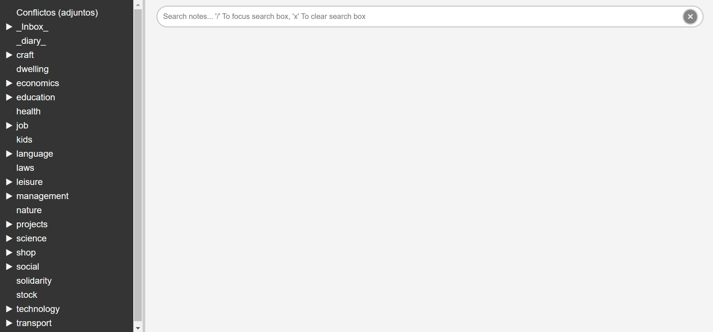

#  Joplin Peeker Server

A simple local web server to browse your Joplin notes and notebooks.


Joplin Peeker is a straightforward project that allows you to browse your Joplin notes and notebooks in your favorite web browser. This enables you to use your preferred browser extensions when searching and viewing your notes. For example, you can use [Vimium](https://chromewebstore.google.com/detail/vimium/dbepggeogbaibhgnhhndojpepiihcmeb) to navigate your notes using only the keyboard and [Markdown Viewer](https://chromewebstore.google.com/detail/markdown-viewer/ckkdlimhmcjmikdlpkmbgfkaikojcbjk) to view an enhanced version of your notes' markdown.

## Running

Joplin Peeker is built with Go for the backend and JS/CSS/HTML for the frontend. No external modules are required, making the build and run process straightforward. After cloning the repository, you can run the server with the default configuration by executing the following command in the project's root folder:

```bash
$ go run peeker_server.go
```

You sould see something like:


**NOTE:** The Joplin desktop/CLI app must be running with the Web Clipper Server enabled. The port and token to access the server can be found in Joplin's settings.


The following parameters can be set to configure the server:

> - *JOPLIN_SERVER*: The address and port of the Joplin Webclipper Server (default: `http://localhost:41184`).
> - *JOPLIN_TOKEN*: The Joplin Authorization token (**required**, no default provided).
> - *PEEKER_HOST*: The address of the Joplin Peeker Server (default: `127.0.0.1`).
> - *PEEKER_PORT*: The port of the Joplin Peeker Server (default: `8080`).

There are three ways to set these parameters. If none are provided, hardcoded default values will be used. The precedence for setting parameters is as follows:

### 1. Using the command line to set the parameters.

```bash
Usage of peeker_server:
  -host string
        Listen address for the peeker server (default: 127.0.0.1)
  -joplin string
        Joplin server address and port (default: http://localhost:41184)
  -port string
        Listen port for the peeker server (default: 8080)
  -token string
        Joplin access token
  -v    Verbose mode (default: false)
```
   
### 2. Set the parameters using environment variables.

```bash
# Example of setting PEEKER_HOST as an environment variable.
export PEEKER_HOST=192.168.1.1
```

### 3. Use a `config.json` file to set the parameters. 

You can also use a config.json file to set the parameters. This file must be located in the same folder as the `peeker_server.go` file or the `peeker_server` executable.

```json
{
    "joplin_server": "http://localhost:41184",
    "joplin_token": "...c183779101c931...",
    "peeker_host": "127.0.0.1",
    "peeker_port": "8080"
}
```

## Accessing the Server

Once configured and running, you can access the Peeker Server in any web browser by navigating to `http://<PEEKER_HOST>:<PEEKER_PORT>`. The initial web page will look something like this:



On the left, you'll see the notebooks tree. Clicking on any notebook will fetch all the notes within that notebook. On the right, there is a search box where you can use the same search syntax as Joplin ([Joplin Searching](https://joplinapp.org/help/apps/search/)).

## Building & Installing.

To create an executable of the server, run this command:

```bash
$ go build peeker_server.go
# This will generate a peeker_server or peeker_server.exe executable.
```

To run the server as a standalone app, you only need the executable and the `static` directory in the same folder where you run the executable.


